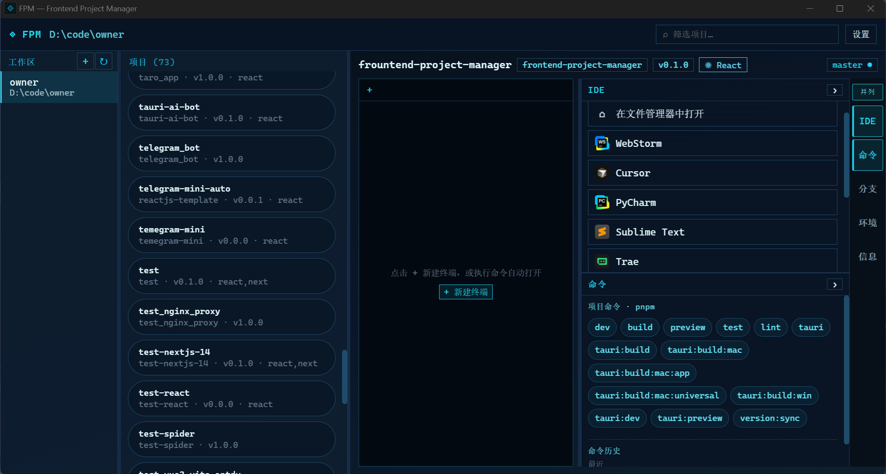

# Frontend Project Manager (FPM)

[](https://github.com/jsoncode/frountend-project-manager/actions/workflows/release.yml)
[](LICENSE)

本地桌面端的**前端项目管理器**：把散落在各处的前端仓库收拢到一个窗口里——浏览项目、跑脚本、开 IDE、看分支，少开十几个文件夹和终端。




## 解决什么问题

做前端久了，常见情况是：

- 机器上同时维护十几个甚至几十个项目，靠资源管理器 / Finder 翻目录很慢
- 每个项目都要单独开终端、记脚本名、切分支、找 `.env`
- VS Code / Cursor / WebStorm 来回切，路径经常找错

FPM 用一个工作区扫描 `package.json` 项目，把**列表、终端、命令、Git、IDE**放在同一屏，减少上下文切换。

## 主要功能

| 能力 | 说明 |
| --- | --- |
| 多工作区 | 添加多个根目录，自动扫描子项目 |
| 项目一览 | 名称、包名/版本、框架、Git 分支信息 |
| 内置终端 | 完整 PTY 终端（Windows: PowerShell / macOS: zsh 等），支持中断、清屏 |
| 一键脚本 | 读取 `package.json` scripts，点一下执行 |
| IDE 打开 | 用已配置编辑器打开项目/工作区；可在文件管理器中定位 |
| Git 面板 | 分支列表、切换、拉取/推送、提交等常用操作 |
| 环境变量 | 查看项目 `.env*`（可隐藏敏感值） |

## 平台支持

| 平台 | 安装包 | 说明 |
| --- | --- | --- |
| Windows | `.exe`（NSIS） | 主要开发与发布目标 |
| macOS Apple Silicon | `.dmg` + `.pkg`（arm64） | 支持 |
| macOS Intel | `.dmg` + `.pkg`（x64） | 支持 |

> `.pkg` 会把 App 安装到 `/Applications`（双击安装，或终端执行 `sudo installer -pkg xxx.pkg -target /`），`.dmg` 则是把 App 拖入 Applications 的传统方式。
> 核心逻辑（扫描、终端、Git、打开 IDE）已做跨平台处理；Windows 特有能力（注册表扫描 IDE、从 exe 抽图标）在 macOS 上使用 Applications / `.app` / `sips` 等对应实现。

## 安装

### 下载安装包（推荐）

到 [Releases](https://github.com/jsoncode/frountend-project-manager/releases) 下载对应系统的安装包。

> 推送形如 `v0.1.0` 的 tag 后，GitHub Actions 会自动打包 **Windows + macOS（Intel / Apple Silicon）** 安装包（`.exe` / `.dmg` / `.pkg`），发布为**草稿**，在所有平台上传完成后到 Releases 页手动点「Publish release」。

macOS 若提示「无法验证开发者」，可在「系统设置 → 隐私与安全性」中允许，或右键 App 选择「打开」。

### 从源码运行

需要：Node.js（LTS）、[pnpm](https://pnpm.io/)、Rust（stable）。

- Windows：WebView2（一般已自带）
- macOS：Xcode Command Line Tools（`xcode-select --install`）

```bash
git clone https://github.com/jsoncode/frountend-project-manager.git
cd frountend-project-manager
pnpm install
pnpm tauri:dev
```

仅调试前端 UI：

```bash
pnpm dev
```

### 本地打包

```bash
# Windows 安装包 → src-tauri/target/release/bundle/nsis/
pnpm tauri:build:win

# macOS DMG + .app → src-tauri/target/release/bundle/dmg/ 和 bundle/macos/
pnpm tauri:build:mac

# 仅 .app（不打 dmg）
pnpm tauri:build:mac:app

# Apple Silicon + Intel 通用包（需本机已安装两个 target）
pnpm tauri:build:mac:universal
```

> macOS 的 `.pkg` 安装包由 GitHub Actions 构建（tauri 不支持 pkg 目标，工作流里用 `pkgbuild` 从 `.app` 现打），本地不生成。

## 发布新版本

1. 确认改动已合并到主分支  
2. 打 tag 并推送（推荐用脚本，自动同步版本号并推送）：

```bash
# 自动 patch 升版（0.4.2 → 0.4.3）并同步 package.json / tauri.conf.json / Cargo.toml，提交后打 tag 推送
pnpm release

# 指定版本
pnpm release 0.5.0

# 只打当前版本的 tag（不升版、不提交）
pnpm release:tag-only
```

3. 等待 [Release](https://github.com/jsoncode/frountend-project-manager/actions/workflows/release.yml) 构建完成，在 [Releases](https://github.com/jsoncode/frountend-project-manager/releases) 草稿中确认各平台安装包齐全后，点击 **Publish release** 发布

也可在 Actions 里手动 **workflow_dispatch** 触发构建（可指定版本号）。

## 技术栈

- [Tauri 2](https://tauri.app/) + Rust  
- React 19 + Vite + 手写 createStore（Zustand 兼容 API，无 zustand 依赖）  
- xterm.js 终端 / Monaco 编辑器

## 开发文档

- [设计规格](docs/superpowers/specs/2026-07-21-frontend-project-manager-design.md)
- [实现计划](docs/superpowers/plans/2026-07-21-frontend-project-manager.md)

## License

[MIT](LICENSE)

---

## English

**FPM** is a desktop app that gathers your frontend repos into one place: scan workspaces, run package scripts in a real terminal, open projects in your IDE, and manage Git branches without juggling dozens of folders.

**Platforms:** Windows (NSIS `.exe`) and macOS (`.dmg` for Apple Silicon and Intel). Pushing a `v*` tag builds all of them via GitHub Actions.

See the screenshot above. Download from [Releases](https://github.com/jsoncode/frountend-project-manager/releases), or run `pnpm install && pnpm tauri:dev`.
