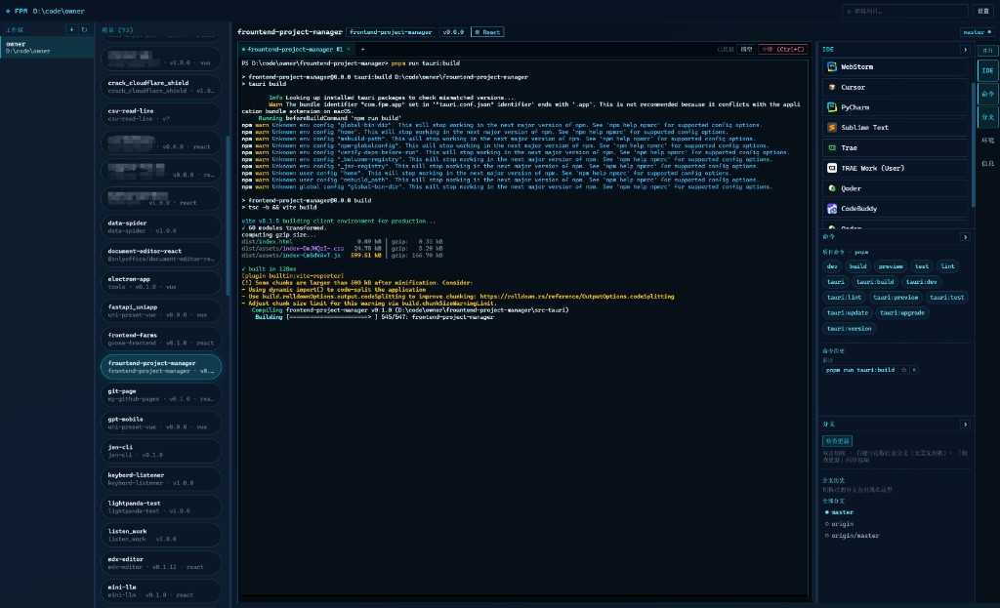

# Frontend Project Manager (FPM)

[](https://github.com/jsoncode/frountend-project-manager/actions/workflows/release-windows.yml)
[](LICENSE)

本地桌面端的**前端项目管理器**：把散落在各处的前端仓库收拢到一个窗口里——浏览项目、跑脚本、开 IDE、看分支，少开十几个文件夹和终端。



## 解决什么问题

做前端久了，常见情况是：

- 机器上同时维护十几个甚至几十个项目，靠资源管理器翻目录很慢
- 每个项目都要单独开终端、记脚本名、切分支、找 `.env`
- VS Code / Cursor / WebStorm 来回切，路径经常找错

FPM 用一个工作区扫描 `package.json` 项目，把**列表、终端、命令、Git、IDE**放在同一屏，减少上下文切换。

## 主要功能

| 能力 | 说明 |
| --- | --- |
| 多工作区 | 添加多个根目录，自动扫描子项目 |
| 项目一览 | 名称、包名/版本、框架、Git 分支信息 |
| 内置终端 | 完整 PTY 终端（PowerShell），支持中断、清屏 |
| 一键脚本 | 读取 `package.json` scripts，点一下执行 |
| IDE 打开 | 用已配置编辑器打开项目/工作区；可在资源管理器中定位 |
| Git 面板 | 分支列表、切换、拉取/推送、提交等常用操作 |
| 环境变量 | 查看项目 `.env*`（可隐藏敏感值） |

## 安装

### 下载安装包（推荐）

到 [Releases](https://github.com/jsoncode/frountend-project-manager/releases) 下载最新 Windows 安装包（`.exe`），安装后打开即可。

> 推送形如 `v0.1.0` 的 tag 后，GitHub Actions 会自动打包并发布 Windows 安装包。

### 从源码运行

需要：Node.js（LTS）、Rust（stable）、Windows 上的 WebView2（一般已自带）。

```bash
git clone https://github.com/jsoncode/frountend-project-manager.git
cd frountend-project-manager
npm install
npm run tauri:dev
```

仅调试前端 UI：

```bash
npm run dev
```

本地打 Windows 安装包：

```bash
npm run tauri:build:win
```

产物一般在 `src-tauri/target/release/bundle/nsis/`。

## 发布新版本

1. 确认改动已合并到主分支  
2. 打 tag 并推送（版本号不要带多余前缀，tag 以 `v` 开头）：

```bash
# 可选：本地先同步版本号到 package.json / tauri.conf / Cargo.toml
npm run version:sync -- 0.2.0

git tag v0.2.0
git push origin v0.2.0
```

3. 等待 [Release Windows](https://github.com/jsoncode/frountend-project-manager/actions/workflows/release-windows.yml) 完成，在 Releases 中下载安装包  

也可在 Actions 里手动 **workflow_dispatch** 触发构建。

## 技术栈

- [Tauri 2](https://tauri.app/) + Rust  
- React 19 + Vite + Zustand  
- xterm.js 终端  

## 开发文档

- [设计规格](docs/superpowers/specs/2026-07-21-frontend-project-manager-design.md)
- [实现计划](docs/superpowers/plans/2026-07-21-frontend-project-manager.md)

## License

[MIT](LICENSE)

---

## English

**FPM** is a desktop app that gathers your frontend repos into one place: scan workspaces, run npm scripts in a real terminal, open projects in your IDE, and manage Git branches without juggling dozens of folders.

See the screenshot above. Download the Windows installer from [Releases](https://github.com/jsoncode/frountend-project-manager/releases), or build from source with `npm install && npm run tauri:dev`. Pushing a `v*` tag builds a new Windows NSIS installer via GitHub Actions.
